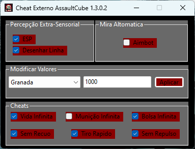
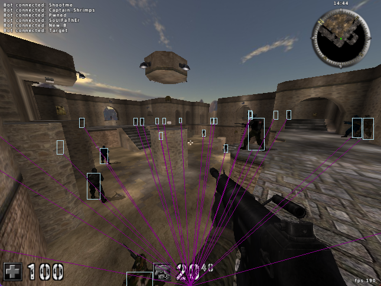
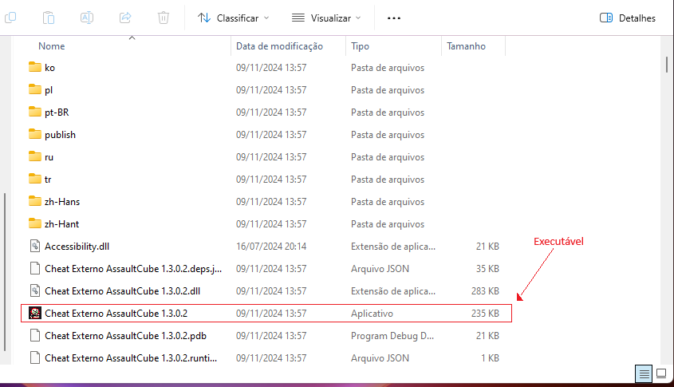

# Cheat Externo AssaultCube 1.3.0.2

## Índice
- [Finalidade do Projeto](#finalidade-do-projeto)
- [Funções](#funções)
- [Instruções de Instalação e Uso do Cheat](#instruções-de-instalação-e-uso-do-cheat)
  - [Requisitos do Sistema](#requisitos-do-sistema)
  - [Instalar o AssaultCube 1.3.0.2](#instalar-o-assaultcube-1302)
  - [Baixar o Cheat](#baixar-o-cheat)
  - [Executar o Cheat](#executar-o-cheat)
- [Tecnologias](#tecnologias)

## Finalidade do Projeto

Este projeto foi desenvolvido estritamente para fins educacionais, com o objetivo de estudar como jogos podem ser manipulados por meio de código e para entender as vulnerabilidades que podem existir em sistemas de software. 

  <strong>⚠️ Importante:</strong> Não é nossa intenção encorajar o uso de cheats de forma maliciosa ou prejudicar a experiência de outros jogadores.

Reforçamos que o uso de cheats em jogos online é contra as regras da maioria dos jogos e plataformas, podendo resultar em banimentos e prejuízos para a comunidade de jogadores. Este código deve ser utilizado somente em ambientes controlados, como servidores privados ou para fins de estudo, e nunca em jogos públicos ou para prejudicar a experiência de outros jogadores.

O principal objetivo deste repositório é fornecer uma base para estudos de segurança e programação, demonstrando como vulnerabilidades podem ser exploradas e, mais importante, como evitá-las.

> **Nota:** O projeto completo se encontra na pasta `Projeto`.

## Funções

Este cheat contém funções simples que funcionam apenas no modo singleplayer. Não são compatíveis com o modo multiplayer, pois foi desenvolvido com fins educacionais, e não para prejudicar a jogabilidade de outros jogadores.

- **ESP**: Desenha um retângulo branco na janela do jogo indicando a localização dos inimigos. *(Observação: O ESP não funciona no modo fullscreen).*
- **Desenhar Linha**: Desenha uma linha que começa na parte inferior da tela e vai até os pés dos inimigos, facilitando a localização deles.
  

- **Aimbot**: Ao apertar o botão direito do mouse, ajusta automaticamente a mira do jogador para a cabeça do inimigo mais próximo.
- **Vida Infinita**: Define a vida do jogador para 9999, de modo que ela não seja reduzida ao tomar dano.
- **Munição Infinita**: A quantidade de munição das armas permanece estática e não diminui ao atirar.
- **Bolsa Infinita**: A quantidade de munição nas bolsas das armas permanece estática e não diminui ao recarregar.
- **Sem Recuo**: A mira do jogador permanece estática e não se movimenta ao atirar, eliminando o recuo das armas.
- **Sem Repulso**: Ao atirar, o jogador não sofre o empuxo (repulse) decorrente do disparo, permanecendo parado enquanto atira.
- **Tiro Rápido**: Aumenta significativamente a velocidade de disparo da arma, anulando o intervalo entre os disparos.
- **Modificar Valores de Atributos**: Permite modificar os valores dos atributos do jogador, como vida, munição, granadas, etc. Para usar, selecione o atributo desejado, insira o novo valor e clique em *Aplicar* para que o atributo seja modificado no jogo.

## Instruções de Instalação e Uso do Cheat

**Observação:** O cheat só funcionará se o **AssaultCube** for da versão "1.3.0.2". Caso contrário, não funcionará.

### Requisitos do Sistema

- **Sistema operacional**: Windows 7 ou superior.
- **Arquitetura**: 32 bits ou 64 bits.

### Instalar o AssaultCube 1.3.0.2

1. **Baixe o AssaultCube 1.3.0.2**:
   - Abra o arquivo ["Downloads"](https://github.com/Luan-S-S/Cheat-Externo-AssaultCube-1.3.0.2/blob/main/Downloads.md).
   - Clique no link de: `Clique aqui para baixar o Instalador do AssaultCube`.
   - Realize o Download do arquivo: `AssaultCube_v1.3.0.2_LockdownEdition` no **MediaFire**. Fique tranquilo, o arquivo é 100% seguro.

2. **Instale o AssaultCube**:
   - Clique no arquivo de instalação do AssaultCube 1.3.0.2 e execute o instalador.

3. **Instalação concluída**:
   - Após a instalação ser concluída, o AssaultCube 1.3.0.2 estará pronto para ser jogado.

### Baixar o Cheat

1. **Instale o WinRAR se necessário**:
   - Se seu computador não tiver a opção de extrair arquivos naturalmente, baixe e instale o **WinRAR**. Ele será necessário para extrair o arquivo ZIP.

2. **Baixe o arquivo ZIP do Cheat**:
   - Abra o arquivo ["Downloads"](https://github.com/Luan-S-S/Cheat-Externo-AssaultCube-1.3.0.2/blob/main/Downloads.md).
   - Clique no link de: `Clique aqui para baixar a verssão release do Cheat`.
   - Faça o download do arquivo `Cheat Externo AssaultCube 1.3.0.2 Release.zip` no **MediaFire**. Fique tranquilo, o arquivo é 100% seguro.
   - Com o arquivo já na sua máquina, clique com o botão direito do mouse e em **WinRAR**, clique em **"Extrair aqui"**.

### Executar o Cheat

1. Entre na pasta `Cheat Externo AssaultCube 1.3.0.2 Release` que foi extraída.

2. Dentro desta pasta, procure o primeiro executável (.exe) chamado: `Cheat Externo AssaultCube 1.3.0.2`.

3. Para executar o cheat, clique duas vezes sobre o executável. **Lembre-se**: para o cheat funcionar, o jogo **tem que estar aberto**.

> **Importante:** O cheat só funcionará se o **AssaultCube 1.3.0.2** estiver aberto e em execução. Caso o jogo não esteja aberto, ao tentar iniciar o cheat, será exibida uma mensagem de erro informando que o jogo não foi detectado.

## Tecnologias

- **Versão do .NET**: O cheat foi desenvolvido utilizando o .NET SDK versão **8.0.400**.
